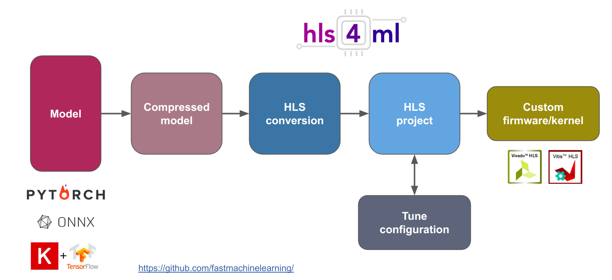
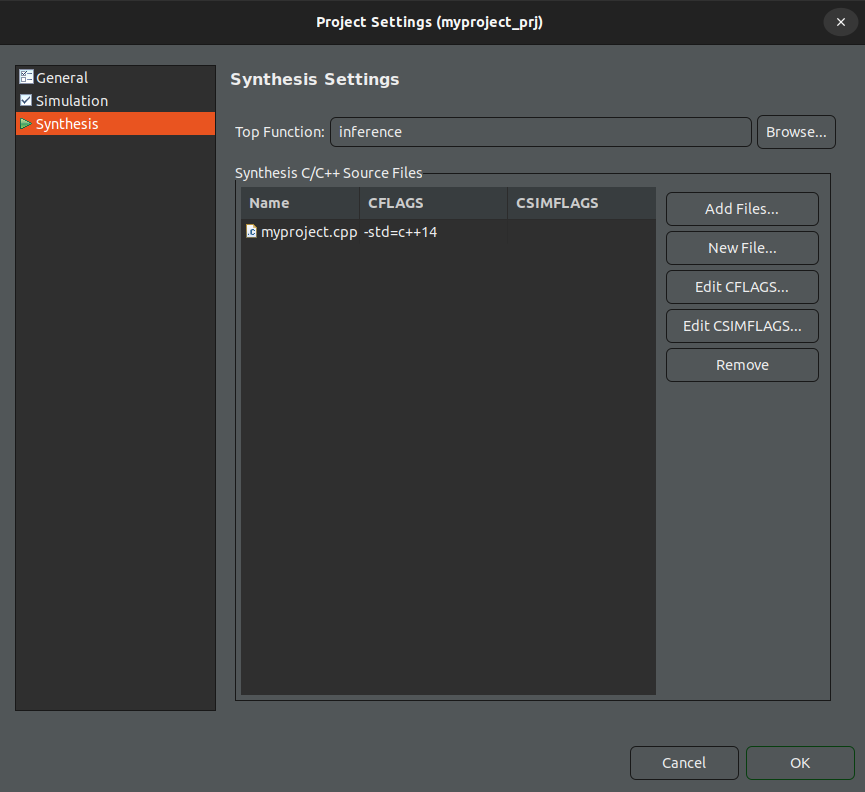
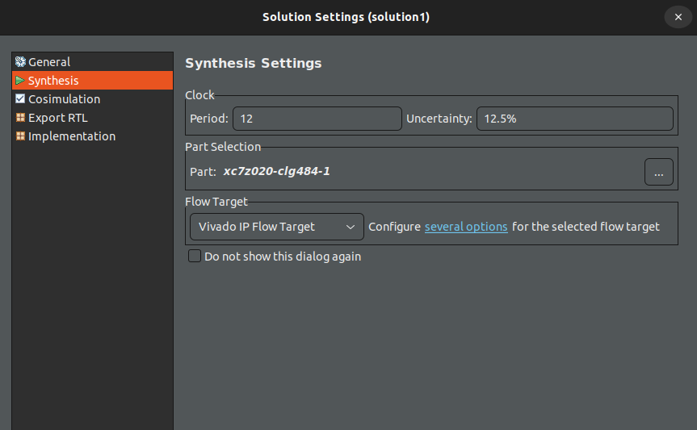
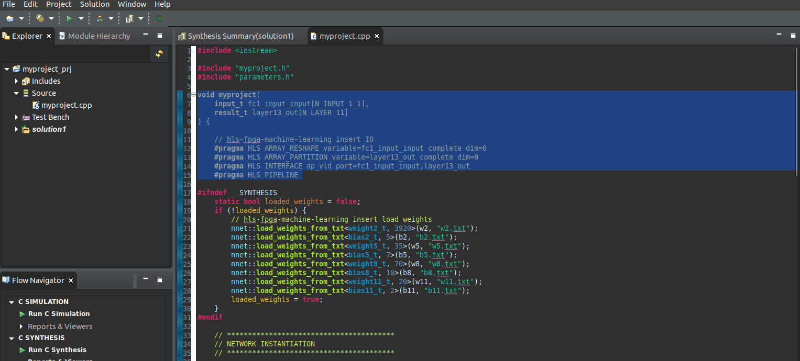
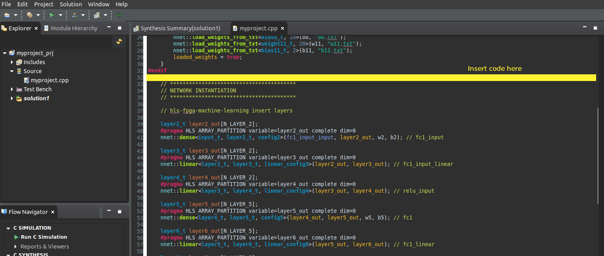
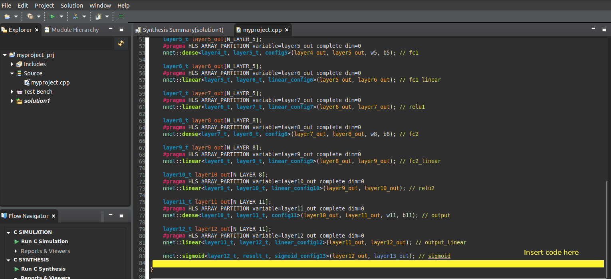
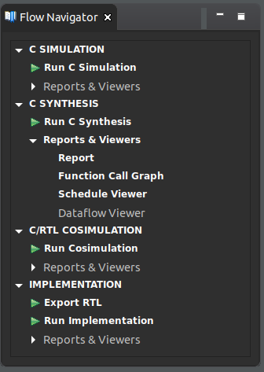
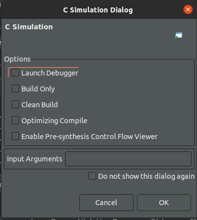
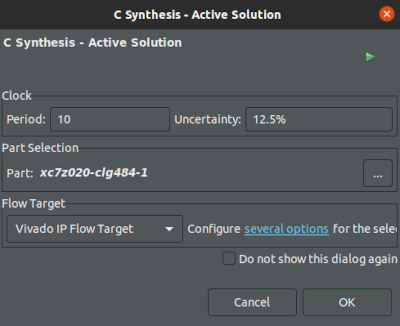
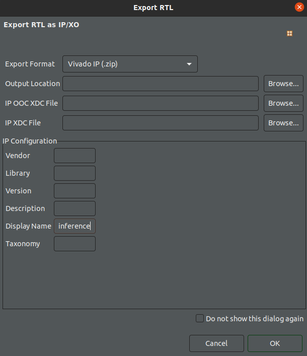

# ML y SoC-FPGA: Integración con una herramienta de síntesis de diseño de hardware para ML


## 1. Introducción

Una vez que se genera el modelo estudiante, el siguiente paso es generar el IP core para integrarlo en el diseño de hardware final. Para ello, se emplea **hls4ml** como un puente entre el modelo generado y la herramienta HLS, como se puede observar en la siguiente figura.




<!--  -->

## 1.1. Objetivos

* Aprender cómo **hls4ml** puede utilizarse para traducir el modelo en un proyecto HLS.
* Explorar las diferentes opciones que proporciona la biblioteca.

# 2. Interacción con hls4ml

El objetivo principal de esta etapa es generar el IP core para la fase de inferencia. Los pasos generales son los siguientes:

1. Agregar la ruta a la herramienta Vitis HLS. 
2. Cargar el modelo estudiante preentrenado.
3. Definir las configuraciones para la biblioteca hls4ml.
4. Convertir el modelo de Keras en un proyecto HLS. 
5. Compilar y construir el proyecto HLS. 
6. Exportar el IP core. 


# 3. HLS simulación, síntesis e implementación

> 🔴 En esta parte del laboratorio, la carpeta que se utilizará fue creada en el laboratorio anterior mediante el Jupyter Notebook, y su ruta es **labs/lab05/hlsPrj/**.

La verificación de la funcionalidad del bloque IP se realiza utilizando la herramienta Vitis HLS. Para lograr esto, es necesario realizar varios cambios en los archivos fuente **.c** generados para agregar las interfaces correspondientes y probar el bloque IP. Por lo tanto, se deben seguir los siguientes pasos:

1. Abre **Vitis HLS**.

1. Abre el proyecto que se encuentra en la carpeta **lab05 -> hlsPrj -> myproject_prj,** que fue generado con el archivo de Jupyter Notebook. De esta manera, el proyecto creado con hls4ml se cargará en Vitis HLS.


3. Realiza las siguientes configuraciones en el proyecto:
    
    - En el menú, ve a **Project -> Project Settings** y haz clic en **Synthesis**. 

    - En la sección **Synthesis settings**, cambia el nombre de la top function a **inference**.
    
    >**Nota**:  La **top function** actúa como el punto de entrada del diseño en Vitis HLS, vinculando todos los puertos de entrada y salida del módulo de hardware. Es responsable de configurar los valores de entrada necesarios y activar el módulo de hardware. Una vez finalizado el cálculo, la _top function_ recopila los valores de salida y los devuelve a la aplicación de software.

    - En la sección **Synthesis C/C++ Source files, dentro de la tabla, haz clic en la entrada myproject.cpp y luego en Edit CFLAGS. Sustituye el texto por: **-std=c++14**.
    
    - Clic **OK**. 

La configuración debería verse como en la siguiente imagen.

{width=70%}

4. Verifica las siguientes configuraciones relacionadas con la solución:. 

    - En el menú, ve a **Solution -> Solution Settings** y haz clic en **Synthesis**.
    - Configura el **Clock** en **12**, con un valor de incertidumbre de **12.5%**. El clock va a estar configurado para una frecuencia de 80 MHz.
    - Selecciona la parte correspondiente: **xc7z020clg484-1**.
    - Deja el **Flow Target** como **Vivado IP Flow Target**.
    - Haz clic en **OK**.

La configuración debería verse como en la siguiente imagen.

{width=70%}

🔴 En este paso, **se deben agregar o reemplazar varias partes del código**. 


5. En este paso, se reemplazarán varias partes del archivo **myproject.cpp** dentro de Vitis HLS. **Las imágenes a continuación te ayudarán a identificar las diferentes partes del código y el lugar donde deben agregarse**.

    Para crear un proyecto HLS utilizando hls4ml con directivas de interfaz específicas, especialmente cuando se trabaja con interfaces _AXI stream_, es necesario modificar la **top level function** y especificar los pragmas de interfaz para los puertos de entrada y salida. Esto requiere el uso de una estructura específica para el flujo de datos, dependiendo de la herramienta HLS (en Vitis HLS, se usa _hls::stream_).
    
    En este proyecto:

    - El puerto de entrada utilizará una interfaz **AXI stream**.
   - Para los puertos de control, se implementará el protocolo **ap_ctrl_hs**.
    - El puerto de salida utilizará la interfaz **ap_vld**.
    <!-- - Para los puertos de control, se implementará el protocolo **s_axilite**. -->

    **ap_ctrl_hs**: Agrega señales de control tipo handshake al bloque HLS. 
    - ap_start – Señal para iniciar la operación.
    - ap_done – Señal que indica que la operación ha terminado.
    - ap_ready – Señal que indica que el bloque está listo para recibir otro ap_start.
    - ap_idle – Señal que indica que el bloque está inactivo.

    **ap_vld**: Por cada señal marcada con _ap_vld_, Vitis HLS genera dos señales:
    - dato: el valor normal del puerto .
    - dato_ap_vld: una señal booleana que toma el valor de 1 cuando dato es válido.
    
    Copia el siguiente código:
    
    ```c
    void inference(
		hls::stream<axis_int_t>& input,
		int *result
    ) {

        //#pragma HLS INTERFACE mode=s_axilite port=return
        #pragma HLS INTERFACE mode=ap_ctrl_hs port=return
        #pragma HLS INTERFACE axis register both port=input
        #pragma HLS INTERFACE ap_vld port=result register
        // #pragma HLS PIPELINE
    
    ```
    
    Reemplazando las partes seleccionadas en el archivo **myproject.cpp**.

    

    

6. Archivo **myproject_test.cpp** (test bench)

- Ve a la carpeta **/home/student/Documents/cursoML2025/git/trainingMDQ2025/labs/lab07/src_hls**. 
- Copia el archivo **myproject_test.cpp** en la carpeta **/home/student/Documents/cursoML2025/labs/lab05/hlsPrj/**. 
- Esto reemplazará el archivo precedente.

7. Archivo **myproject.h**

- Ve a la carpeta **/home/student/Documents/cursoML2025/git/trainingMDQ2025/labs/lab07/src_hls**.
- Copia el archivo myproject.h en la carpeta: **/home/student/Documents/cursoML2025/labs/lab05/hlsPrj/myproject_prj/firmware**.
- Esto reemplazará el archivo precedente.


10. En Vitis HLS, en el panel **Explorer**, abre el archivo **Source -> myproject.cpp**. 


    🔴 Agrega el siguiente código en  **myproject.cpp**. Este cambio permitirá desempaquetar el flujo de entrada (input stream) en un vector para que pueda ser utilizado por el algoritmo.

    ```c
	input_t fc1_input_input[N_INPUT_1_1];
    result_t layer13_out[N_LAYER_11];

    axis_int_t val;

    for(int h=0; h<N_INPUT_1_1; h++){

    #pragma HLS PIPELINE

    			// Read and cache value
    			val = input.read();
    			fc1_input_input[h] = val.data/255;

    		}	
    ```

    El código anterior debe colocarse después de la línea **#endif** (línea número 32) en el archivo **myproject.cpp**.

    

    🔴 El siguiente código permite generar la salida con los resultados de la clasificaión. **Esta manera es válida solo si está usando el modelo generado en el demo de MNIST QAP. De lo contrario, debe UTILIZAR y ADAPTAR la segunda opción**

     ```c
        // Opción 1
            if(layer12_out[1] < 0){
                *result = 1;
            } else{
                *result = 9;
            }

    ```

    ```c
        // Opción 2
            if(layer13_out[0] > 0.5){
            // result tiene el valor de la clase (del tipo int) que desea mostrar por la terminal, por ejemplo 1 y 2.
                *result = 1;
            } else{
                *result = 2;
            }

    ```
    
    Agrega el código anterior antes de **\}** (última línea) en el archivo **myproject.cpp**.

    

Una vez que se completen las modificaciones del código, es momento de analizar cómo se comporta el bloque IP cuando se utilizan imagenes de MNIST como entradas.

11. Ve al panel de **Flow Navigator** (en la esquina inferior izquierda). Bajo **C SIMULATION**, haz clic en **Run C Simulation**.

    


12. Aparecerá una ventana *C Simulation Dialog*. Haz clic en **OK**. La simulación comenzará. Espera los resultados.

    


13. Después de la simulación, en el panel de Flow Navigator, bajo **C SYNTHESIS**, haz clic en **Run C Synthesis**. Aparecerá una ventana emergente con configuraciones para la solución activa, mostrando los valores para el reloj, la parte del FPGA y el objetivo de flujo.
Deja estas configuraciones tal como están y haz clic en el botón **OK**. Espera el informe de síntesis.

    


14. El paso final es generar el bloque IP. En el panel **Flow Navigator** (en la esquina inferior izquierda), bajo **IMPLEMENTATION**, haz clic en **Export RTL**. En la opción _Display Name_, agrega el nombre **inference**. Haz clic en el botón **OK**. Espera hasta que se complete el proceso de exportación.

    

Con el bloque IP generado, es momento de probar el proceso de inferencia en la plataforma SoC. **Para esta parte, seguiremos con el laboratorio 8. Hay 3 opciones diferentes para el despliegue en hardware. Para el próximo paso vamos a focalizarnos en 01-Baremetal.**


