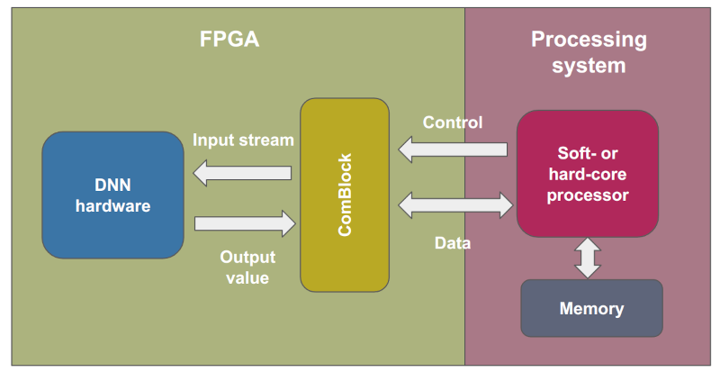
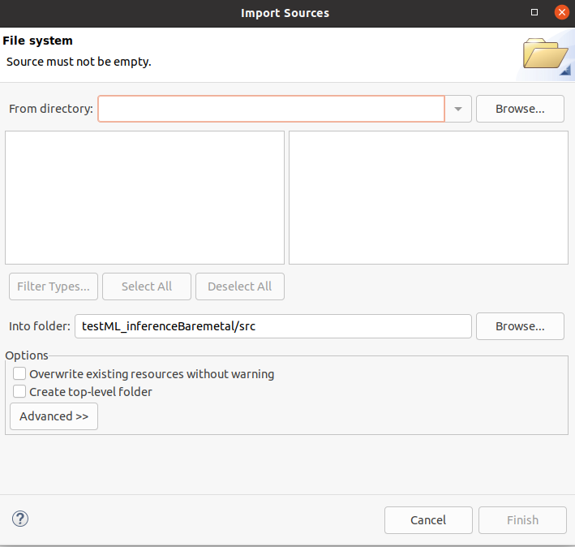
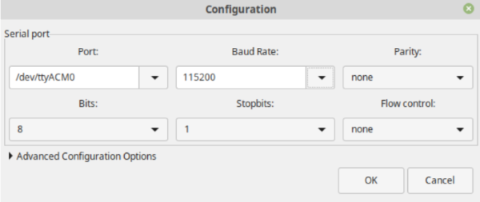

# ML y SoC-FPGA: Hardware de verificación


## 1. Outline

### 1.1. Introducción



<!-- {width=70%} -->

### 1.2. Objetivos

* Aprender a implementar modelos basados en ML en plataformas SoC-FPGA.
* Realizar la instanciación de un IP core previamente diseñado mediante una herramienta de síntesis de alto nivel.
* Integrar y verificar el diseño de hardware completo.


#### 1.3.2 Tool Command Language (TCL)

Tool Command Language (**TCL**) es un lenguaje de scripting utilizado, para interactuar con la línea de comandos de Vivado, entre otros. Permite la creación y manipulación de proyectos para FPGA, la configuración de restricciones de diseño, la síntesis e implementación de diseños, y otras tareas dentro del entorno de Vivado mediante la automatización basada en scripts. Este lenguaje de scripting es una herramienta valiosa para optimizar el proceso de diseño y desarrollo para FPGA, permitiendo compartir proyectos en entornos colaborativos.

La herramienta Vivado también genera un archivo conocido como "vivado.jou", que sirve como registro de los comandos TCL ejecutados durante la sesión. Este archivo de registro puede utilizarse como referencia para generar nuevos scripts en TCL.

La estructura general de los comandos TCL en Vivado es:

``` bash
command [optional_parameters] required_parameters
```

Para más información, puedes consultar [TCL reference manual](https://docs.xilinx.com/v/u/2012.2-English/ug835-vivado-tcl-commands)


# 2. Hardware

## 2.1. Proyecto de Vivado

1. Ejecutar _Vivado 2022.2_.

2.  En el menu **Quick Start**, click  en  para inicializar el asistente o click en **File → Project → New**.  **Create A New Vivado Project** dialog box in the **New Project** window. Click **Next**.Utilizar la información en la siguiente tabla para configurar las diferentes opciones del asistente:


| Opción del Asistente | Propiedad del Sistema | Configuración |
|---------------|-----------------|----------|
| Project Name | Project Name | Lab08-01 |
|  | Project location | `/home/student/Documents/cursoML2025/labs/lab08/01-Baremetal/` |
|  | Create Project Subdirectory | Check this option. |
| Click **Next** |  |  |  
| Project Type | Project Type | Select **RTL Project**. Keep  unchecked the option `do not specify sources at this time`.  | 
| Click **Next** |  |  | 
| Add Sources | Do nothing |  |  
| Click **Next** |  |  |  
| Add Constraints | Do Nothing |  |  
| Click **Next** |  |  |  
| Default Part | Specify | Select **Boards** |  
|  | Board | Select **ZedBoard Zynq Evaluation and Development Kit** |  
| Click **Next** |  |  |  
| New Project Summary | Project Summary | Review the project summary |  
| Click **Finish** |  |  | 

## 2.2. Respositorio IP

<!-- **[TO CHECK]** 🔴 Before you continue, copy the **ComBlock IP** folder into the **IP** directory.
-->

### 2.2.1. Agregar IP cores al repositorio

<!-- In this section you'll import the external IP cores into the project: **HLS-based ML inference** and *ComBlock**.

1. Click **Settings** in the Flow Navigator. Expand the **IP** option on the left pane of the Project Settings form.

2. Click on **Repository**, then click on the **Add** icon. -->
En esta sección, importarás el IP core externo al proyecto: **HLS-based ML inference**.

1. Hacer click en **Settings** en el Flow Navigator. Expandir la opción **IP** en el panel izquierdo de **Project Settings**.

2. Hacer click en **Repository**, luego en el ícono **Add**.


3. Ir al directorio `/home/student/Documents/cursoML2025/labs/lab05/hlsPrj/myproject_prj/solution1/impl`, seleccionarlo, y finalmente hacer click en el botón **Select** . Este directorio contiene el IP cores exportado en el laboratorio de hls4ml. 

4. Click en **OK** para finalizar el proceso en ambas ventanas. 


## 2.3. Block Design
Haremos uso de Tool Command Language (**TCL**) para construir un diseño a nivel de bloque a partir de los archivos fuente proporcionados y un script TCL. Notarás cómo Vivado comenzará a construir el sistema desde cero hasta obtener un diseño sintetizable. Esta es una forma limpia de trabajar con herramientas de control de versiones (como Git) en entornos colaborativos.

1. Este proyecto utiliza un diseño de bloque pre-generado (block design, BD). Para volver a generarlo, en el panel inferior de Vivado, haz clic en la pestaña **Tcl Console**.

2. Para saber en qué directorio estás trabajando, escribe en la línea de comandos TCL `pwd`. Esto mostrará el directorio de trabajo actual.


``` bash
pwd
```

3. Cambia tu directorio de trabajo al directorio **bd**. Para ello, usa el comando tcl **cd** para cambiar el directorio. Escribe:

``` bash
cd labs/lab08/bd/Zedboard/
```


4. Un archivo TCL puede ser cargado desde Vivado. Para recrear el diseño de bloque, necesitarás un archivo de comandos tcl, que en este caso es **bd_inference.tcl**. Para recrear el diseño de bloque, escribe en la consola Tcl:

``` bash
source ./ML-zedboard-ap_ctrl_hs.tcl
```

>**Nota:** Cuando activas la ejecución de un script Tcl en Vivado, aparecerá una barra de progreso y todas las operaciones dentro de Vivado se detendrán hasta que el script termine de ejecutarse.

Como resultado del proceso, obtendrás un diseño de bloque con los siguientes componentes principales: el sistema de procesamiento Zynq7, ComBlock, y el bloque de inferencia basada en HLS. El diseño de bloque final debería verse como sigue:


5. Click en **Regenerate Layout** y observa más de cerca el diseño, las conexiones y los registros de configuración.

6. **Generar output products** del diseño de bloque **bd_inference.bd**


7. **Crear HDL wrapper** del diseño de bloque (_bd_inference.bd_) y configurarlo como **Top**.


8. En el panel  **Flow Navigator**, haz click en **Generate Bitstream** y haz clic en **Yes** si se te solicita guardar el **Block Diagram**. También haz clic en Sí cuando se te pida lanzar la síntesis e implementación. Haz clic en **Cancel** cuando se te pida abrir el **Implemented Design**.

9. Dado que necesitas crear una aplicación para usar el diseño, debes exportar el hardware generado al entorno Vitis. Haz click en: **File -> Export -> Export Hardware**. Dado que hay algo de lógica en la parte PL del Zynq, el bitstream respectivo debe incluirse en la tarea de exportación. Por lo tanto, asegúrate de marcar la casilla **Include bitstream**. Luego haz click en **Next**.

En este punto, tu diseño de hardware y configuración están listos y puedes proceder a generar un proyecto de aplicación en Vitis.


# 3. Software

## 3.1. Ejecutar Vitis IDE configurar un espacio de trabajo


En Vivado, ejecuta Vitis IDE haciendo clic en  **Tools > Launch Vitis IDE**. Se abrirá el cuadro de diálogo Lanzar Vitis IDE, solicitando el directorio del espacio de trabajo. Haz clic en **Browse**  para especificar el directorio del espacio de trabajo. **Como recomendación, usa el mismo directorio de tu proyecto.**

## 3.2. Vitis Application Project

En esta sección, crearás el proyecto de aplicación y el código para utilizar el diseño de hardware.

1. Seleccionar **File -> New -> Application Project** o en la ventana principal click en . Para crear la nueva aplicación, utiliza la siguiente información:


| Pantalla del Asistente | Propiedad del Sistema | Configuración |
|---------------|-----------------|----------|
| Create a New Application Project | | |
| Click **Next** | | |
| Platform | Click **Create a new platform from hardware** | |
| | XSA Flie: | Browse: **bd_wrapper.xsa** |
| Click **Next** | | |
| Application Project Details | Application project name | **app_inference** |
| Click **Next** | | |
| Domain | Name: | freertos10_xilinx_ps7_cortexa9_0 |
| | Display Name: | freertos10_xilinx_ps7_cortexa9_0 |
| | Operating System: | standalone | 
| | Processor: | ps7_cortexa9_0 |
| | Architecture: | 32-bit |
| Click **Next** | | |  
| Templates | Available Templates: | **Empty Application (C)** | 
| Click **Finish** | | | 


Después de hacer clic en **Finish**, el **New Application Project Wizard** se cierra y el proyecto creado se abre en la interfaz principal de Vitis, que está dividida en las secciones: Explorer, Assistant, Project Editor y Console. En las vistas Explorer y Assistant, podrás ver dos elementos creados:  application y and  platform project.

2. Una vez generado el proyecto, en el **Explorer** (panel izquierdo), ir a **app_inference_system->app_inference->src** . Clic derecho en la carpeta **src** y seleccionar **Import Sources**. Aparecerá una ventana como la siguiente. 



3. Clic en **Browse** y sleccionar la carpeta que se encuentra en `/home/student/Documents/cursoML2025/git/trainingMDQ2025/labs/lab08/vitis_app`. Selecciona el archivo **ML-app-ap_ctrl_hs.c**. Este archivo contiene el codigo que se encarga de inicializar el IP core generado en HLS y establecer la comunicacion entre el PL y el PS a traves del ComBlock. 

# 4. Verificación

## 4.1. Configurando la placa de desarrollo Zedboard

1. Conecta la ZedBoard a tu computadora a través de 2 cables micro-USB y la fuente de alimentación. 

2. Enciende la placa de desarrollo ZedBoard.

### 4.2. Configuración del software de comunicación serial

1. Se hará uso de **GTKTerm** para establecer la comunicación serial entre la máquina host y la ZedBoard. Para configurar GTKTerm, abre el software haciendo clic en **Applications -> Accessories -> Serial port terminal**.

{width=50%}

Aparecerá una ventana similar a la que se muetra a continuación:


2. Haz clic en **Configuration > port** y selecciona el puerto **ttyACM0** (ttyUSB1 para PYNQ) con Baud Rate **115200**.


{width=50%}

### 4.3.  Ejecución de la aplicación en la placa de desarrollo ZedBoard

1. En el software Vitis, haz clic derecho sobre *app_helloWorld*, luego selecciona **Run -> Run As -> Launch on Hardware (Single application debug (GBD))** para reconfigurar la FPGA y ejecutar el código compilado en el PS.

2. En Vitis, aparecerá una ventana emergente indicando que la FPGA está siendo programada. Al finalizar este proceso, el LED azul en la ZedBoard se encenderá.


3. Vuelve a la ventana de **GTKTerm**. Si todo funciona correctamente, deberías ver el resultado de la ejecución de la aplicación en la consola serial remota.


